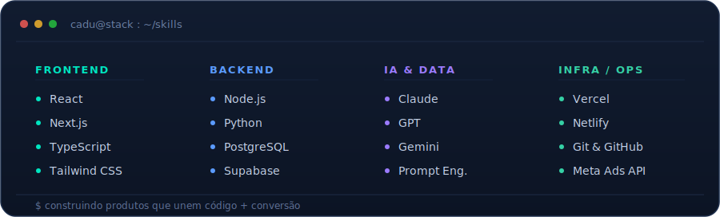

<!-- ============ HERO ============ -->

<!-- ============ TYPING ANIMADO ============ -->

  

<!-- ============ BOTOES DE CONTATO (custom) ============ -->

  &nbsp;
  &nbsp;
  &nbsp;

 

<!-- ============ 01 · SOBRE ============ -->

E aí! Me chamo **Carlos Eduardo** — mas pode chamar de **Cadu** 👋

Vivo na fronteira entre **código e conversão**: construo produtos, SaaS e automações que resolvem problema de verdade **e vendem**. Junto a cabeça de **desenvolvedor** com a de **marketeiro de resposta direta** — e é essa mistura que me faz criar coisa que funciona no mundo real, não só no `localhost`.

- 🔵 &nbsp;**Blue Ocean** — **Desenvolvedor IA Pleno**: plataformas internas, agentes de IA e automações pra operação de tráfego, CS e gestão.
- 🟠 &nbsp;**Direto Ads** — **Founder**: minha empresa de **Direct Response Marketing** — funis, ofertas, criativos e infra própria de vendas.
- 🎓 &nbsp;Estudante de **Análise e Desenvolvimento de Sistemas** — Universidade Católica de Brasília.
- 💡 &nbsp;Gosto de **criar do zero**, com tecnologia moderna, boas práticas e obsessão por resultado.

> *"Não basta ser bonito no código — tem que converter."*

 

<!-- ============ 02 · CONSTRUINDO ============ -->

| | Projeto | O que é |
|:--:|:--|:--|
| 🔵 | **Blue Ocean OS** | Plataforma interna + agentes de IA (tráfego, CS, SEO) pra uma agência com 220+ clientes |
| 🟠 | **Direto Ads / DiretoPay** | Ecossistema de resposta direta: gateway de pagamento próprio, checkout e tracking |
| 🕵️ | **Library Pro** | SaaS de espionagem da Biblioteca de Anúncios do Meta |

 

<!-- ============ 03 · STACK ============ -->

  

 

<!-- ============ 04 · STATS ============ -->

  
  

  

  

 

<!-- ============ RODAPE ============ -->

  

  <i>Do Brasil 🇧🇷 pro mundo — código + conversão.</i>

